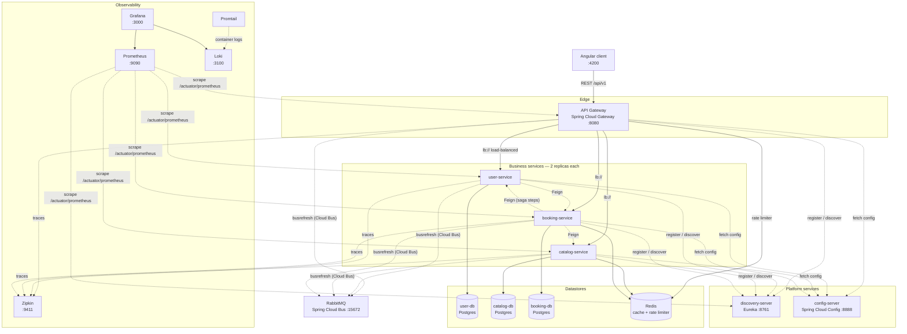
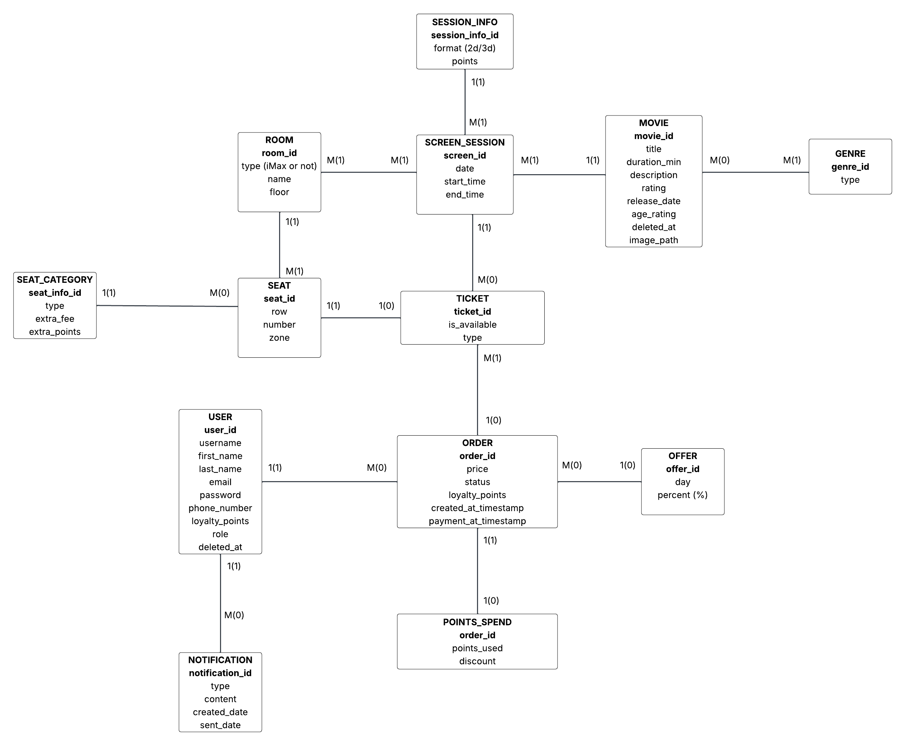

# Web-Applications--Cinema-Booking-Management-Platform

The application is a Cinema Booking & Management System platform that lets users browse available movies, select screenings and book tickets, and lets administrators manage the platform's content (movies, rooms, schedule).
The system was initially designed as a monolithic application, later to be decomposed into a microservices-based architecture. The split is based on the application's main responsibilities: user management, movie management, and booking management.

### User Management
The system must allow user registration.
The system must allow user authentication.
The system must allow users to log out.
The system must manage roles.
The system must restrict access to certain features based on role.

### Movie Management
The system must allow viewing the list of movies.
The system must allow viewing the details of a movie.
Administrators must be able to: add movies, edit movies, delete movies.
The system must allow associating movies with screenings.
The system must allow searching and sorting movies.

### Screening and Room Management
The system must allow creating screenings for movies.
The system must allow associating a screening with a cinema room.
The system must manage the available seats in a room.
The system must allow viewing the available seats for a screening.

### Booking Management
Users must be able to: select a screening, select available seats, view their own bookings, cancel bookings.
The system must allow creating a booking.
The system must generate tickets for each booked seat.
The system must prevent double-booking of the same seat.

# Architecture

The platform is split into three business services (`user`, `catalog`, `booking`),
each owning its **own** Postgres database, fronted by an API gateway and supported
by platform services (service discovery, centralized config), shared infrastructure
(Redis, RabbitMQ) and an observability stack (Prometheus/Grafana/Loki/Zipkin).

The Angular client only ever talks to the **gateway** (`/api/v1`). The gateway
load-balances across the **2 replicas** of each business service via Eureka
(`lb://<service>`). Services call each other over the Docker network with Feign
(`/internal/**` endpoints, not exposed through the gateway).



Solid arrows are the synchronous request path; dotted arrows are
discovery/config, Spring Cloud Bus config refresh, and observability flows.

# Running the Application

## Prerequisites

- Docker + Docker Compose v2.
- A `.env` file at the repo root (copy from `.env.example`).
- Set a TMDB API key in `.env`, along with a sufficiently long JWT Secret Key

## Start Monolith

```bash
docker compose -f docker-compose.yml up --build
```

### Stop

```bash
docker compose -f docker-compose.yml down        # keep data
docker compose -f docker-compose.yml down -v     # also drop DB volumes
```
## Start Microservices

```bash
docker compose -f docker-compose.microservices.yml up --build
```

First run is slow: the shared image compiles the whole reactor (`mvn install`), then
each service container compiles + boots its module. Watch the healthchecks; the
gateway only starts routing once `user-service`, `catalog-service`, and
`booking-service` report healthy.

### Stop
```bash
docker compose -f docker-compose.microservices.yml down        # keep data
docker compose -f docker-compose.microservices.yml down -v     # also drop DB volumes
```

## Ports

| URL                          | Component                                                             |
|------------------------------|-----------------------------------------------------------------------|
| http://localhost:8080/api/v1 | **API gateway** (what the frontend uses)                              |
| http://localhost:4200        | Angular client  (Default bootstrap user login: `admin`/`Redacted1!`)  |
| http://localhost:8761        | Eureka dashboard (`discovery-server`)                                 |
| http://localhost:8888        | config-server (Spring Cloud Config; `/encrypt`, `/<service>/default`) |
| http://localhost:15672       | RabbitMQ management UI (Spring Cloud Bus; `guest`/`guest`)            |
| http://localhost:9411        | Zipkin distributed-tracing UI                                         |
| http://localhost:3000        | Grafana dashboards (`admin`/`admin`)                                  |
| http://localhost:9090        | Prometheus (metrics & scrape targets)                                 |
| http://localhost:3100        | Loki log API (queried through Grafana)                                |

Internal `/internal/**` endpoints are **not** routed by the gateway — they are reachable
only over the Docker network (service-to-service Feign calls).

The three business services (`user-service`, `catalog-service`, `booking-service`) run **2
instances each** and are reachable only through the gateway on `http://localhost:8080`. 
See **Load Balancing** below.

# Relational Schema



# Service Discovery (Eureka)

The microservices register themselves with a **Netflix Eureka** service registry
(`discovery-server`, host port **8761**) instead of using hardcoded inter-service
URLs. The gateway routes to services by name (`lb://user-service`, etc.) and the
Feign clients resolve their targets by service name through the registry.

## Eureka dashboard

With the stack running, open **http://localhost:8761**. The "Instances currently
registered with Eureka" table lists every running app:
`USER-SERVICE`, `CATALOG-SERVICE`, `BOOKING-SERVICE`, and `GATEWAY`. Stop a
service (`docker compose -f docker-compose.microservices.yml stop catalog-service`)
and refresh — its instances disappear from the table; start it again
(`docker compose -f docker-compose.microservices.yml start catalog-service`) and they
re-register automatically. This is the live proof that services discover each other
with no static configuration.

## What the logs show

- On startup each app logs its registration, e.g.
  `DiscoveryClient_CATALOG-SERVICE/... - registration status: 204`
  (`com.netflix.discovery` at INFO).
- On each inter-service call, the caller logs the name→instance selection, e.g.
  the gateway and booking-service log LoadBalancer choosing an instance for
  `catalog-service` (`org.springframework.cloud.loadbalancer` at DEBUG).

Because resolution is by service name, no URL changes are needed to move or scale
a service — the registry always reports its current location.

# Centralized Configuration (Spring Cloud Config)

All four microservices fetch their configuration at startup from a **Spring Cloud
Config server** (`config-server`, host port **8888**) rather than carrying full
local config. Each service keeps only a tiny bootstrap (its name +
`spring.config.import=configserver:...`); everything else — shared defaults in
`application.yml` plus a per-service `<service>.yml` — lives in
`microservices/config-server/config-repo/` and is served centrally. The server uses the
**native** (filesystem) backend, and that directory is mounted into the container
as a volume, so edits on the host are served on the next fetch without rebuilding.

## Encrypted secrets

Sensitive values are stored as `{cipher}`-encrypted text and decrypted by the
config server before being served (clients receive plaintext and need no crypto
of their own). Encryption is symmetric, keyed by `ENCRYPT_KEY` from `.env`.
`JWT_SECRET_KEY` ships this way in the committed `application.yml`.

To (re)encrypt a value, with the config server running:

```bash
curl -X POST http://localhost:8888/encrypt -d 'the-secret-value'
```

Copy the output and paste it into the relevant config file as `'{cipher}<output>'`.
To rotate a secret, re-encrypt and then `busrefresh` (below) — no restart.

> **Security note:** the config server also exposes `/decrypt`. That's convenient
> locally (port 8888 is mapped to the host), but in a real deployment you should
> disable `/decrypt` or keep 8888 off the host.

## Live configuration refresh (no restart)

Config changes propagate to running services via **Spring Cloud Bus over
RabbitMQ** — no restart, no redeploy. Edit a served value, then broadcast a
refresh to the whole fleet by POSTing to the gateway:

```bash
curl -X POST http://localhost:8080/actuator/busrefresh
```

Every service receives the event over RabbitMQ and rebinds. Watch the broadcast
in the RabbitMQ management UI at **http://localhost:15672** (default `guest`/`guest`).

**Test:** the business services' `JwtAuthenticationFilter` logs one line per
request at DEBUG (`JWT filter processing GET /api/v1/... (jwt cookie absent)`).
`logging.level.com.awbd.cinema` defaults to `INFO`, so that line is hidden. Set
it to `DEBUG` in `microservices/config-server/config-repo/application.yml`, run
the `busrefresh` above, then hit any business endpoint through the gateway
(e.g. `curl http://localhost:8080/api/v1/movies`) — the line now appears in the
catalog-service logs, with no restart. Set it back to `INFO` + `busrefresh` and
it's gone again.

### RabbitMQ management UI

The bus broker (`rabbitmq:3-management`) exposes a web console at
**http://localhost:15672**.

- **Username / password:** `guest` / `guest` (the image default — no credentials
  are configured in `docker-compose.microservices.yml`, and the services connect
  with Spring's default `guest`/`guest`).
- Under **Queues** you'll see one queue per running instance, named
  `springCloudBus.<service>-<uuid>` (e.g. `springCloudBus.catalog-service-…`), each
  bound to the `springCloudBus` exchange. Watching their message rates while you
  run `busrefresh` shows the refresh event fanning out to every service.

# Service-to-Service Security

Internal endpoints (`/internal/**`) are authenticated with a short-lived
service JWT, not just network isolation. On every outgoing Feign call the
calling service mints a ~60s token (`typ=SERVICE`, `sub=<service-name>`,
signed with the shared `jwt.secret.key`) and sends it as
`Authorization: Bearer …`. Each service enforces a dedicated `/internal/**`
security chain that validates the token and requires `ROLE_SERVICE`. This is
independent of the user's `jwt` cookie (which still authenticates public
endpoints) — the `typ` claim keeps the two token kinds non-interchangeable.
The TTL is tunable via `SERVICE_TOKEN_TTL_SECONDS` (default 60).

## Seeing it work (logs)

Every internal call leaves a matched pair of `INFO` lines across two
services' logs — one where the caller mints/attaches the token, one where
the callee verifies it. Registration is the easiest trigger (user-service →
booking-service):

```bash
# Trigger a user->booking internal call
curl -s -X POST http://localhost:8080/api/v1/auth/register \
  -H 'Content-Type: application/json' \
  -d '{"username":"demo","password":"Password123!","confirmPassword":"Password123!","email":"demo@example.com","firstName":"Demo","lastName":"User","phoneNumber":"+1234567890"}' >/dev/null

# Caller side (user-service minted + attached the token):
docker compose -f docker-compose.microservices.yml logs user-service | grep "Attached service token"
# Callee side (booking-service verified it as ROLE_SERVICE):
docker compose -f docker-compose.microservices.yml logs booking-service | grep "authenticated as service"
```

Negative proof — `/internal/**` is **not reachable from the host** at all: the
business services publish no host ports (they run as load-balanced replicas),
and the gateway does not route `/internal/**`. To show the rejection you must
call the endpoint from *inside* the Docker network, bypassing the gateway by
hitting the service name directly (`curl` is present in the service image):

```bash
# No token -> 401
docker compose -f docker-compose.microservices.yml exec gateway \
  curl -i "http://catalog-service:8080/api/v1/internal/ticket-setup?seatId=1&roomId=1&sessionId=1"
# Forged token -> 401, and catalog-service logs "Rejecting internal request with invalid service token"
docker compose -f docker-compose.microservices.yml exec gateway \
  curl -i -H "Authorization: Bearer garbage" \
  "http://catalog-service:8080/api/v1/internal/ticket-setup?seatId=1&roomId=1&sessionId=1"
```

(From the host, `curl http://localhost:8080/api/v1/internal/ticket-setup` just
returns `404` — the gateway has no such route — which is itself a form of
proof that internal endpoints aren't externally exposed.)

# Running the Microservices Stack (Docker)

The new microservices architecture lives in `microservices/` (a multi-module Maven
reactor) and runs via `docker-compose.microservices.yml`. It is independent of the
original monolith (`docker-compose.yml`) — run one or the other, not both at once
(the gateway and the monolith both use host port 8080).

## Prerequisites

- Docker + Docker Compose v2.
- A `.env` file at the repo root (copy from `.env.example`). It must include the
  three microservices DB-name vars:

  ```
  USER_DB_NAME=user_db
  CATALOG_DB_NAME=catalog_db
  BOOKING_DB_NAME=booking_db
  ```

  It must also include `ENCRYPT_KEY` (the config server's symmetric decryption
  key — see *Centralized Configuration* above). All other vars (`DATABASE_USER`,
  `DATABASE_PASSWORD`, `JWT_SECRET_KEY`, `TMDB_API_KEY`, `BOOTSTRAP_OWNER_*`,
  `SECURITY_*`) are shared with the monolith.

## Load Balancing (multiple instances)

The stack runs **2 instances of each business service** (`user-service`, `catalog-service`,
`booking-service`) via Docker Compose `deploy.replicas`. Client-side load balancing is provided by
**Spring Cloud LoadBalancer** (default round-robin) in two places:

- the **gateway** routes (`lb://user-service`, …) distribute external requests across instances;
- **Feign** clients distribute inter-service (`/internal/**`) calls across instances by service name.

Each instance stamps an `X-Served-By: <service>@<host>:<port>` response header and logs
`served <method> <uri> by <id>` for every non-actuator request.

### See gateway load balancing (no auth needed)

Register the `demo` user first (see **Smoke test** above), then loop the public login endpoint and
watch the `X-Served-By` header alternate across the two user-service instances:

```bash
for i in $(seq 1 10); do
  curl -s -o /dev/null -D - -X POST http://localhost:8080/api/v1/auth/login \
    -H 'Content-Type: application/json' \
    -d '{"username":"demo","password":"Password123!"}' \
  | grep -i '^X-Served-By'
done
```

PowerShell:

```powershell
1..10 | ForEach-Object {
  (Invoke-WebRequest -Uri http://localhost:8080/api/v1/auth/login -Method Post `
    -ContentType 'application/json' `
    -Body '{"username":"demo","password":"Password123!"}').Headers['X-Served-By']
}
```

You should see two distinct `user-service@<host>:8080` ids appear across the 10 requests.

### How it works

Each instance registers with Eureka (`prefer-ip-address: true`, so replicas get distinct ids).
The gateway resolves `lb://<service>` routes and Feign resolves `@FeignClient(name = "<service>")`
through Eureka, and **Spring Cloud LoadBalancer** picks an instance per call using its default
round-robin strategy. No load-balancer configuration is added — multiplicity plus the
`X-Served-By` header and request logging are all that's needed to demonstrate it.

### Distributed Transactions and the Saga Pattern

One of the more advanced engineering aspects of the project is how it handles the booking workflow across service boundaries. When a user completes a purchase, the
operation involves multiple steps across the Booking Service and the Catalog Service - reserving seats, creating an order, processing payment, and awarding loyalty
points. In a distributed system, any one of these steps can fail, which could leave the data in an inconsistent state.

To address this, the Booking Service implements the Saga orchestration pattern through two coordinated sagas: CreateOrderSaga and PayOrderSaga. The orchestrator
drives the workflow step by step and, if any step fails, triggers compensating actions to undo the work already done - for example, releasing reserved seats if
payment fails. This ensures the system remains consistent even in the face of partial failures, without relying on a distributed database transaction.


